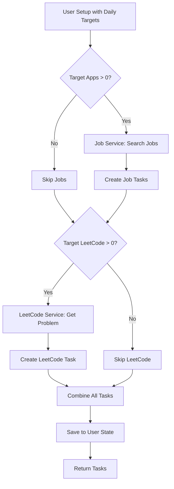

# Phase 2: Task System - Complete ✅

## Summary

Phase 2 of Project Cerebro has been successfully completed. The task generation system is now fully functional, integrating job search APIs and LeetCode problem fetching.

## What Was Built

### 1. Job Service ✅
- **File**: `backend/app/services/job_service.py`
- **Features**:
  - Adzuna API integration (ready for API key)
  - Mock job data for development/testing
  - Job search by keywords, location, and country
  - Returns structured job listings with title, company, URL, description

### 2. LeetCode Service ✅
- **File**: `backend/app/services/leetcode_service.py`
- **Features**:
  - Curated list of 13 LeetCode problems (Easy, Medium, Hard)
  - Problem selection by difficulty
  - Problem filtering by topic/tag
  - Returns problem details with title, URL, difficulty, topics
  - GraphQL API structure ready for future implementation

### 3. Task Service ✅
- **File**: `backend/app/services/task_service.py`
- **Features**:
  - Combines job listings and LeetCode problems
  - Generates tasks based on daily targets
  - Converts between Task objects and dictionaries
  - Handles datetime serialization/deserialization

### 4. Setup Endpoint ✅
- **File**: `backend/app/routers/setup.py`
- **Endpoint**: `POST /api/setup`
- **Features**:
  - Initialize user state with daily targets
  - Generate initial tasks automatically
  - Create user state JSON file
  - Returns created user state with tasks

### 5. Task Routes (Updated) ✅
- **File**: `backend/app/routers/tasks.py`
- **Endpoints**:
  - `GET /api/tasks/today` - Get today's tasks
  - `POST /api/tasks/generate` - Generate new tasks
  - `POST /api/tasks/reset` - Reset for new day
- **Features**:
  - All endpoints fully implemented
  - Task generation with job search keywords
  - Task reset (moves today → yesterday, generates new today)
  - Proper error handling and user state validation

### 6. File Storage Fix ✅
- **File**: `backend/app/storage/file_storage.py`
- **Fix**: Corrected path resolution for data directory
- Now properly resolves `data/user_states/` relative to backend directory

## API Endpoints (Phase 2 Status)

| Endpoint | Method | Status | Description |
|----------|--------|--------|-------------|
| `/api/setup` | POST | ✅ Working | Initialize user with daily targets |
| `/api/tasks/today` | GET | ✅ Working | Get today's tasks |
| `/api/tasks/generate` | POST | ✅ Working | Generate new tasks (with keywords) |
| `/api/tasks/reset` | POST | ✅ Working | Reset tasks for new day |

✅ = Fully implemented and tested

## Usage Examples

### 1. Setup User (First Time)
```bash
POST /api/setup
{
  "daily_target": {
    "apps": 3,
    "leetcode": 1
  }
}
```

**Response:**
```json
{
  "message": "User setup completed successfully",
  "user_id": "demo_user",
  "daily_target": {"apps": 3, "leetcode": 1},
  "tasks_generated": 4,
  "tasks": [
    {"id": "job_...", "type": "job", "title": "...", "url": "..."},
    ...
  ]
}
```

### 2. Get Today's Tasks
```bash
GET /api/tasks/today?user_id=demo_user
```

**Response:**
```json
{
  "tasks": [...],
  "daily_target": {"apps": 3, "leetcode": 1},
  "orb_inventory": {"gold": 0, "blue": 0, "red": 0}
}
```

### 3. Generate New Tasks
```bash
POST /api/tasks/generate?keywords=frontend+developer&user_id=demo_user
```

**Response:**
```json
{
  "message": "Tasks generated successfully",
  "tasks": [...],
  "count": 4
}
```

### 4. Reset Tasks (New Day)
```bash
POST /api/tasks/reset?user_id=demo_user
```

**Response:**
```json
{
  "message": "Tasks reset successfully",
  "today_tasks": [...],
  "yesterday_tasks": [...]
}
```

## Task Generation Flow



## Files Created/Updated

### New Files:
- `backend/app/services/job_service.py` - Job search API integration
- `backend/app/services/leetcode_service.py` - LeetCode problem fetching
- `backend/app/services/task_service.py` - Task generation logic
- `backend/app/routers/setup.py` - User setup endpoint

### Updated Files:
- `backend/app/routers/tasks.py` - Complete implementation of task routes
- `backend/app/main.py` - Added setup router
- `backend/app/storage/file_storage.py` - Fixed path resolution

## Testing Results

✅ **Job Service**: Successfully generates mock job listings  
✅ **LeetCode Service**: Successfully selects problems by difficulty  
✅ **Task Service**: Successfully combines jobs and LeetCode problems  
✅ **Task Generation**: Generates correct number of tasks (apps + leetcode)  
✅ **Storage**: Successfully saves and loads user state with tasks  
✅ **All Imports**: All modules import correctly  
✅ **FastAPI App**: Server initializes with all new routes  

## Task Structure

Each generated task contains:
- `id`: Unique identifier (e.g., `"job_123_abc123"`, `"leetcode_1_def456"`)
- `type`: Task type (`"job"` or `"leetcode"`)
- `title`: Display title (e.g., `"Frontend Developer at Tech Startup Inc."`)
- `url`: Task URL (job listing or LeetCode problem)
- `description`: Task description
- `created_at`: Timestamp of creation
- `completed`: Boolean flag (default: false)
- `completed_at`: Completion timestamp (null until completed)

## Mock Data

### Jobs (5 mock listings):
- Frontend Developer at Tech Startup Inc.
- React Developer at Innovation Labs
- Senior Frontend Engineer at Cloud Systems
- Full Stack Developer at Digital Solutions
- JavaScript Engineer at Web Innovations

### LeetCode Problems (13 curated):
**Easy (5 problems):**
- Two Sum
- Valid Parentheses
- Best Time to Buy and Sell Stock
- Contains Duplicate
- Maximum Subarray

**Medium (5 problems):**
- Add Two Numbers
- Longest Substring Without Repeating Characters
- 3Sum
- Generate Parentheses
- Permutations

**Hard (3 problems):**
- Median of Two Sorted Arrays
- Merge k Sorted Lists
- Longest Valid Parentheses

## Next Steps (Phase 3+)

### Phase 3: Verification System
- Gmail API integration for email verification
- LeetCode profile checking for submission verification
- Orb generation logic (Gold/Blue/Red)
- Agent response system (Joy, Sadness, Logic)

### Phase 4: Frontend
- React/Next.js setup
- Dashboard UI
- Orb jar visualization
- Task display components

### Phase 5: Advanced Features
- War Room LLM integration
- Weekly insights analytics
- ElevenLabs audio integration
- Adaptive recommendations

## Notes

- Job API: Currently uses mock data. Set `JOB_API_KEY` in `.env` to use Adzuna API
- LeetCode: Uses curated list. GraphQL API structure ready for future implementation
- Task Storage: Tasks are stored as dictionaries in JSON files
- User ID: Currently uses `demo_user` as placeholder. Will be replaced with Auth0 user_id in Phase 3
- Path Resolution: Storage now correctly resolves `data/user_states/` relative to backend directory
